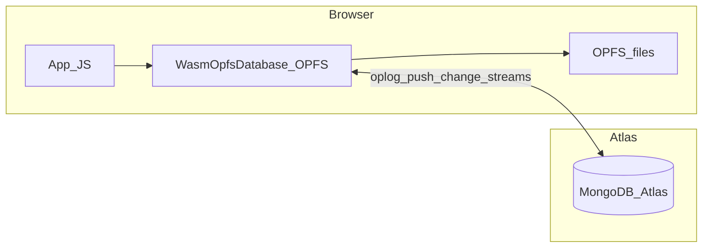

# smongo roadmap

This file is the **single consolidated roadmap** for the engine, WASM/browser, product features (geospatial / time series / graph), Python sync tiers, and Python wire-path interop. It replaces the former split documents: `SQLITEPATH.md`, `PATH2WASM.md`, `WHATSNEXT.md`, `UPNEXT4SYNC.md`, `FUTUREPLANS.md`, and `WHATS_LEFT_TODO.md`.

## Table of contents

| Section | Contents |
|---------|----------|
| [Part 1 — Engine](#part-1--engine) | Shipped inventory, Post-1.0 index, build phases, 1.0 criteria |
| [Part 2 — WASM](#part-2--wasm-and-browser) | Phases 1–4, OPFS, Atlas-from-browser blueprint |
| [Part 3 — Geospatial, time series, graph](#part-3--geospatial-time-series-graph) | `$geoNear`, 2dsphere, time series, `$graphLookup` |
| [Part 4 — Python sync](#part-4--python-sync-tiers) | `SyncManager` tiers, enterprise sync |
| [Part 5 — Python wire path](#part-5--python-wire-path-and-interop) | Interop elimination, benchmarks, stretch goals |

Related (not merged): [SYNC-NOTES.md](SYNC-NOTES.md), [LOCAL-FIRST.md](LOCAL-FIRST.md), [rust/smongo-engine/wasm/](rust/smongo-engine/wasm/).

---

## Part 1 — Engine

## Architecture

```
┌──────────────────────────────────────────────────────┐
│                  smongo-engine (rlib)                 │
│                                                      │
│  Pure Rust. bson::Document throughout.               │
│  redb storage, pluggable backend traits,             │
│  query planner, aggregation, indexes, oplog,         │
│  schema validation.                                  │
├────────────┬───────────────┬──────────────┬──────────┤
│ C ABI      │  PyO3 shim    │  napi-rs     │  WASM    │
│ (smongo-c) │  (smongo-py)  │  (smongo-    │          │
│            │               │   node)      │          │
├────────────┼───────────────┼──────────────┼──────────┤
│ C/C++/Go/  │  Python       │  Node.js     │  Browser │
│ Swift/Java │               │              │          │
└────────────┴───────────────┴──────────────┴──────────┘
```

**Single embedded experience:** One engine (`smongo-engine`) drives the same BSON / MQL / oplog semantics everywhere. **Native** bindings use **redb** on disk. **Browser** uses the **same WASM** binary with **in-memory** (`WasmDatabase` / `MemBackend`) or **OPFS-backed** persistence (`WasmOpfsDatabase` / `OpfsBackend` with handles provided by JS: worker, Web Locks, multi-tab RPC — see [Part 2 — WASM](#part-2--wasm-and-browser) and [rust/smongo-engine/wasm/PERSISTENCE-AND-LIFECYCLE.md](rust/smongo-engine/wasm/PERSISTENCE-AND-LIFECYCLE.md)). **Python** `RustLocalCollection` still persists documents in **WiredTiger** ([LOCAL-FIRST.md](LOCAL-FIRST.md)), but **`2dsphere`** index maintenance and geo **`find()`** / streaming run through **`smongo-engine`** on the shared WT `StorageSession` adapter — there is **no** second WiredTiger-backed geo index implementation in `RustIndexManager`.

**WASM — Phases 1–3 complete:** `wasm32-unknown-unknown` build, browser harness, OPFS persistence. **Phase 4** (Atlas sync from browser) and **Phase 3b** (optional alternate storage) are roadmap — see [Part 2 — WASM](#part-2--wasm-and-browser).

**Design principles:**
- `bson::Document` is the lingua franca inside the engine
- Raw BSON bytes at every FFI boundary (same wire format as MongoDB)
- Opaque handles at the C ABI (`SmongoDb*`, `SmongoCollection*`) -- SQLite pattern
- Synchronous API everywhere; callers own concurrency
- Pluggable storage via `StorageBackend` / `StorageSession` / `StorageCursor` traits

---

## What's Shipped

### Engine (`smongo-engine`)

| Module | What it does |
|--------|-------------|
| `storage` | Pluggable backend traits + redb (production) and in-memory (test) implementations |
| `paths` | Dot-notation traversal on `bson::Document` |
| `query` | Predicate evaluation: `$gt/$lt/$in/$regex/$elemMatch/$mod/$text/$expr/...` |
| `update` | `$set/$inc/$push` (with `$position/$slice/$sort`), `$setOnInsert`, upsert support |
| `collection` | Full CRUD, `FindOptions` (sort/limit/skip/projection), `UpdateOptions` (upsert), `FindCursor` streaming iterator, single-collection transactions, `reap_expired()` |
| `collection` (view) | `CollectionView` -- session-borrowed handle for multi-collection transactions |
| `database` | `Database::open`, collection management, stats, `TransactionSession` for multi-collection transactions, `reap_ttl()` |
| `index` | B-tree indexes on redb, auto-maintained on writes, TTL indexes (`expire_after_seconds`) |
| `planner` | Cost-based: `IndexSeek` > `IndexScan` > `CollectionScan` |
| `explain` | `explain_find`, `explain_aggregate` with efficiency metrics |
| `aggregation` | 21 stages, 17 accumulators, expression evaluator (incl. 8 date operators), streaming pipeline |
| `oplog` | `OplogWriter`, `OplogReader`, `ChangeStream` |
| `schema` | `$jsonSchema` validation on insert |

**Query operators:** `$gt`, `$gte`, `$lt`, `$lte`, `$eq`, `$ne`, `$in`, `$nin`,
`$exists`, `$type`, `$regex`, `$not`, `$all`, `$elemMatch`, `$size`, `$mod`,
`$and`, `$or`, `$nor`, `$expr`, `$text`, `$comment`

**Update operators:** `$set`, `$unset`, `$inc`, `$mul`, `$min`, `$max`,
`$currentDate`, `$rename`, `$addToSet`, `$push` (with `$each`, `$position`,
`$slice`, `$sort`), `$pull`, `$pop`, `$setOnInsert`

**Aggregation stages:** `$match`, `$project`, `$limit`, `$skip`, `$sort`,
`$group`, `$count`, `$unwind`, `$addFields`/`$set`, `$unset`,
`$replaceRoot`/`$replaceWith`, `$sample`, `$redact`, `$sortByCount`,
`$bucket`, `$bucketAuto`, `$lookup`, `$graphLookup`, `$facet`, `$setWindowFields`

**Expression operators:** Arithmetic (`$add`, `$subtract`, `$multiply`, `$divide`,
`$mod`), String (`$concat`, `$substr`, `$toLower`, `$toUpper`), Conditional
(`$cond`, `$ifNull`, `$switch`), Array (`$arrayElemAt`, `$size`, `$map`,
`$filter`, `$in`), Object (`$mergeObjects`, `$let`, `$literal`, `$type`),
Comparison (`$eq`-`$lte`), Logic (`$and`, `$or`, `$not`), Type conversion
(`$toString`, `$toInt`, `$toDouble`, `$toBool`), Math (`$abs`, `$ceil`,
`$floor`, `$round`), Date (`$year`, `$month`, `$dayOfMonth`, `$hour`,
`$minute`, `$second`, `$dayOfWeek`, `$dayOfYear`)

### Bindings

**C ABI** (`smongo-c`): `libsmongo_c.{dylib,a}` + `smongo.h`. ~30 exported functions
covering lifecycle, CRUD, cursors, indexes, aggregation, explain, transactions
(`SmongoSession`), and TTL reaping. `_with_options` variants for find
(sort/limit/skip/projection) and update (upsert).

**Node.js** (`smongo-node`): `@smongo/embedded` via napi-rs. `MongoClient`,
`Database`, `Collection`, `ClientSession` classes. Full CRUD with options,
aggregation, indexes, multi-collection transactions, TTL indexes, and
`Collection.close()` for explicit session release. Auto-generated TypeScript types.

**Python** (`smongo-py`): Full CRUD, indexes, schema validation, and aggregation
delegate to `smongo-engine`. Locking, oplog logging, and Python type conversion
remain in the shim layer.

---

## What's Left

### 0.9.x Gate — COMPLETE

All three gate items have been shipped and tested across all bindings:

- **Engine-level transactions** — `TransactionSession` for multi-collection
  transactions; `CollectionView` for session-borrowed collection handles;
  single-collection `with_transaction` RAII wrapper. Tested in engine, Node.js
  (`ClientSession`), and C ABI (`SmongoSession`).
- **Cursor-based `find()`** — `FindCursor<'a>` streaming iterator with
  `FindCursorState` supporting CollectionScan, IndexScan, and IndexSeek
  strategies. Lazy evaluation via `Iterator` trait.
- **TTL indexes** — `expire_after_seconds` on `IndexOptions`, `DateTime` key
  encoding, `Collection::reap_expired()` and `Database::reap_ttl()`. Tested
  across all bindings.

### Post-1.0

| Feature | Effort | Notes |
|---------|--------|-------|
| WASM Phase 4 — Atlas sync from browser | TBD | Oplog / change streams / conflict policy — [Part 2 — WASM](#part-2--wasm-and-browser) |
| WASM Phase 3b — optional engine storage | TBD | IndexedDB / redb-on-WASM / non-JS hosts — orthogonal to shipped JS-orchestrated OPFS |
| Server mode (wire protocol) | 4 weeks | Not needed for embedded positioning |
| Geospatial | — | **2dsphere** ( **`smongo-engine`** on Python WT storage / **redb** in Node): `$geoNear`, **`$near`/`$nearSphere`**, **`$geoWithin`** (`$centerSphere` + **`$geometry` Point/Polygon/MultiPolygon**), **`$geoIntersects`**. **Legacy flat `2d`, `$box`, `$center`, flat `$polygon` are out of scope** — [Part 3](#part-3--geospatial-time-series-graph) |
| Text search indexes | 2-3 weeks | Basic `$text` exists; full-text index does not |
| Go/Java/Ruby bindings | 2-3 weeks each | Mechanical via C ABI |
| Array filters (`$[elem]`) | 1 week | Positional update syntax |
| Benchmarking suite | 1 week | Performance regression detection |
| `$out`/`$merge` stages | 1 week | I/O-dependent aggregation stages |

### Known Limitations

- Index key encoding is simplified (no full MongoDB type-tagged sort keys)
- Descending index direction not encoded in key bytes

---

## Build Phases (Historical)

The engine was built in 12 phases + 4 deferred phases, each completable in one
focused session. The original plan diverged at Phase 6 to build foundational
capabilities (Database API, Indexes, Planner, Explain, Aggregation) before
tackling Oplog, Schema, and smongo-py rewire.

| Phase | What |
|-------|------|
| 1 | Cargo workspace + `smongo-engine` crate (zero PyO3) |
| 2 | `paths` module -- dot-notation on `bson::Document` |
| 3 | `query` module -- predicate evaluation |
| 4 | `update` module -- update operators |
| 5 | `collection` module -- full CRUD on WiredTiger |
| 6 | `database` module -- top-level entry point |
| 7 | `index` module -- B-tree indexes |
| 8 | `planner` module -- cost-based query optimization |
| 9 | `explain` module -- execution stats |
| 10 | `aggregation` module -- 21 stages, 17 accumulators, expressions, streaming |
| 11 | `smongo-c` -- stable C ABI |
| 12 | `smongo-node` -- Node.js binding via napi-rs |
| D1 | `oplog` module -- pure Rust change tracking |
| D2 | `schema` module -- `$jsonSchema` validation |
| D3 | smongo-py rewire -- full CRUD delegation to engine |
| D4 | Index-aware aggregation -- `$match` pushdown |
| S1 | `$mod` query, `$push` modifiers, `$setOnInsert`/upsert, date expressions, `FindOptions` |
| S2 | Cursor-based `find()` -- `FindCursor` streaming iterator |
| S3 | Engine-level transactions -- `TransactionSession`, `CollectionView`, `with_transaction` |
| S4 | TTL indexes -- `expire_after_seconds`, `reap_expired`, `reap_ttl` |
| S5 | Binding coverage -- `ClientSession` (Node), `SmongoSession` (C), `Collection.close()` |
| S6 | Storage migration -- WiredTiger replaced with redb (pure Rust, WASM-ready) |
| S7 | WASM Phase 1 -- `cfg`-gated redb/parking_lot/fs/SystemTime; compiles for `wasm32-unknown-unknown` |
| S8 | WASM Phases 2–3 -- wasm-pack harness, OPFS + `WasmOpfsDatabase`, lifecycle / error contracts, demos |

---

## Success Criteria for 1.0

1. ~~`cargo build -p smongo-engine` with zero PyO3 imports~~ ✓
2. ~~A C program links `libsmongo_c` and performs CRUD without Python~~ ✓
3. ~~`npm test` passes for the Node.js binding~~ ✓ (39/39, 0 skipped)
4. Python `smongo` delegates to engine; existing tests pass
5. ~~Same database readable from Python, Node, and C~~ ✓
6. ~~**Multi-document transactions** work across all bindings~~ ✓
7. ~~**Cursor-based find** streams results without full materialization~~ ✓
8. ~~**TTL indexes** with automatic document expiry~~ ✓

---

## Part 2 — WASM and browser

Status snapshot: **WiredTiger → redb** in `smongo-engine` (April 2026); browser Phases 1–3 shipped.

## Where We Are

### WiredTiger is gone from smongo-engine

| Before | After |
|--------|-------|
| `wiredtiger-sys` (C FFI, dlopen, unsafe) | `redb` 2.3 (pure Rust, zero unsafe in engine) |
| 4 `wt/` files + `find_wiredtiger_library()` | 3 `storage/` files (traits + redb + memory) |
| Blocked on `wasm32` — C object files, link errors | **No C code in the engine crate** |

The `smongo-engine` dependency tree is pure Rust. On native targets,
`redb` and `parking_lot` are included; on `wasm32` they are excluded
via target-specific `Cargo.toml` sections:

```
smongo-engine v0.9.3

Always:
├── bson 2.15          (pure Rust BSON)
├── chrono 0.4         (date/time)
├── rand 0.8           (ObjectId generation)
├── regex 1            (query $regex)
├── serde / serde_json (serialization)
└── uuid 1             (oplog keys)

Native only (cfg(not(target_arch = "wasm32"))):
├── redb 2.3           (storage — single-file ACID B-tree)
└── parking_lot 0.12   (sync primitives for oplog)

WASM only (cfg(target_arch = "wasm32")):
└── getrandom 0.2      (js feature — routes to crypto.getRandomValues)
```

Zero `*-sys` crates. Zero `cc`/`cmake` build dependencies. Zero `unsafe` blocks in
engine source (286 tests, all passing on native).

### What still references WiredTiger

`smongo-py` has its own `wt_bridge.rs` and `wt_safe/` modules that talk directly to
`wiredtiger-sys`. That crate is untouched by this migration — it's a separate Python
binding layer and is not needed for the WASM story.

---

## What Was Done (Phase 1) -- COMPLETE

All five blockers identified below have been resolved. `smongo-engine`
compiles for `wasm32-unknown-unknown` with zero errors and zero warnings.

### 1. `libc` / platform-specific deps -- DONE

`getrandom` with `js` feature added as a WASM-only dependency. `chrono`
compiles for wasm32 without issue (macOS-only transitive deps are absent
on wasm32 via `#[cfg]` in the crate itself).

### 2. `redb` file I/O -- DONE (MemBackend default)

`redb` moved to native-only target dependency. On WASM, `MemBackend` is
the default via `storage::DefaultBackend` type alias. `Database::open()`
(filesystem-backed) is `#[cfg(not(target_arch = "wasm32"))]`; WASM
consumers use `Database::from_backend(MemBackend::new(), ...)`.

**Persistent browser storage (OPFS)** uses one WASM binary for both modes: **in-memory** via `WasmDatabase` (`MemBackend`). **Durable** via `WasmOpfsDatabase`: Rust **`OpfsBackend`** implements `StorageBackend` over `FileSystemSyncAccessHandle` values; a **dedicated worker** runs the WASM instance that holds those handles; the main thread uses [`opfs-wrapper.js`](rust/smongo-engine/wasm/opfs-wrapper.js) (Web Locks + per-`dbName` RPC + `BroadcastChannel`) so only one tab owns sync handles and others proxy. **JS owns process model** (locks, worker lifecycle, multi-tab); **Rust owns** sync I/O on the handles inside the worker.

**Phase 3b — optional follow-ups** (orthogonal to the shipped path above — not “implement OPFS from scratch”):

| Approach | Effort | Tradeoff |
|----------|--------|----------|
| **IndexedDB `StorageBackend`** — engine storage without OPFS sync handles | Medium | Async vs sync traits; broader engine support |
| **redb on WASM** — if upstream lands | Wait | Monitor [cberner/redb#463](https://github.com/cberner/redb/issues/463) |
| **Non-browser WASM hosts** (WASI, etc.) | Medium | Different I/O surface; same engine |
| **Tests / tooling** without full JS harness | Low–Medium | Optional convenience only |

### 3. `parking_lot` -- DONE

`parking_lot` moved to native-only target dependency. On WASM,
`std::sync::Mutex` is used. `ChangeStream::next()` uses non-blocking
try-next semantics on WASM (no `Condvar`).

### 4. `std::fs` in `Database::open` -- DONE

`Database::open()`, `Database::drop()`, and `get_directory_size()` are
gated behind `#[cfg(not(target_arch = "wasm32"))]`. `stats()` returns
`size_bytes: 0` on WASM.

### 5. `std::time::SystemTime` in oplog and collection -- DONE

`now_time_nanos()`, `now_time_secs_f64()`, and `now_epoch_millis()`
helper functions return 0 on WASM (Phase 1 stub). Phase 2 can replace
these with `js_sys::Date::now()` for real timestamps.

---

## Concrete Next Steps

```
Phase 1 — Prove it compiles          DONE (April 2026)
  ├─ rustup target add wasm32-unknown-unknown                    ✓
  ├─ cargo check -p smongo-engine --target wasm32-unknown-unknown ✓
  ├─ getrandom "js" feature for WASM target dep                  ✓
  ├─ redb + parking_lot → native-only target deps                ✓
  ├─ cfg-gate std::fs / SystemTime / Condvar                     ✓
  ├─ DefaultBackend / DefaultSession type aliases                ✓
  └─ MemBackend as default on wasm32                             ✓

Phase 2 — Browser smoke test         DONE (April 8, 2026)
  ├─ wasm-pack build smongo-engine                               ✓
  ├─ JS test harness: new Database → insert → find → assert      ✓
  ├─ Verify BSON round-trip through JS ↔ WASM boundary           ✓
  ├─ Replace time stubs (now returns 0) with js_sys::Date::now() ✓
  ├─ Benchmark: 10k inserts, 1k finds                            ✓
  ├─ WASM bundle: 1.8MB uncompressed (release build)             ✓
  └─ Build time: ~23 seconds (wasm-pack build)                   ✓

Phase 3 — Persistent browser storage   DONE (April 2026)
  ├─ OPFS persistence: dedicated worker + opfs-wrapper.js (Web Locks, multi-tab RPC) ✓
  ├─ Canonical app entry: smongo-browser.js + lifecycle / error docs ✓
  ├─ Demos + Playwright multitab harness ✓

Phase 3b — Optional alternate persisted backends   (roadmap)
  ├─ IndexedDB / redb-on-WASM / non-JS WASM hosts (see table above)
  └─ Orthogonal to shipped JS-orchestrated OPFS + OpfsBackend

Phase 4 — Local-first browser + Atlas    (roadmap; effort TBD)
  ├─ Oplog tail + checkpointed push (align with Python BSON oplog story — [Part 4 — Python sync](#part-4--python-sync-tiers) Tier 2.1 spirit)
  ├─ Pull via Change Streams or polled cursor; apply to local WASM DB
  ├─ Transport: fetch / WebSocket / EventSource as constraints allow (CORS, auth)
  ├─ Conflict policy: converge with [Part 4 — Python sync](#part-4--python-sync-tiers) / [SYNC-NOTES.md](SYNC-NOTES.md) semantics (LWW vs vector clocks / rules)
  └─ Lifecycle: respect [PERSISTENCE-AND-LIFECYCLE.md](rust/smongo-engine/wasm/PERSISTENCE-AND-LIFECYCLE.md) (reconnect, multi-tab, OpfsError codes)
```

### Phase 4 work breakdown (blueprint)

| Track | What to build | Notes |
|-------|----------------|--------|
| **Oplog on WASM** | Durable oplog for all mutating ops in OPFS mode; expose tail / read-from-checkpoint to JS (wasm-bindgen or thin helper) | Same logical entries as engine / Python BSON oplog where possible |
| **Push** | Batch oplog → remote `bulk_write` over **fetch** (± WebSocket); **safe checkpoint** advance only on full batch success | Mirror ideas from `smongo/sync.py` — partial failure visibility |
| **Pull** | Atlas Change Streams (or equivalent) → apply to local collections | Browser driver / HTTP constraints are explicit product risks |
| **Conflict policy** | Document and implement chosen strategy | Prefer parity with existing sync configuration concepts |
| **Integration** | Pause/resume with OPFS owner loss, reconnect, bfcache | Do not fight `reconnectOpfsDatabase` / `OPFS_OWNER_*` |



---

## Architecture Diagram (WASM target)

```
┌─────────────────────────────────────┐
│          Browser / Worker           │
│                                     │
│  ┌───────────────────────────────┐  │
│  │   JS API  (wasm-bindgen)      │  │
│  └──────────────┬────────────────┘  │
│                 │                    │
│  ┌──────────────▼────────────────┐  │
│  │      smongo-engine (WASM)     │  │
│  │                               │  │
│  │  Collection · Database · Query│  │
│  │  Aggregation · Index · Oplog  │  │
│  │                               │  │
│  │  ┌─────────────────────────┐  │  │
│  │  │    storage traits       │  │  │
│  │  └──────┬──────────┬───────┘  │  │
│  │         │          │          │  │
│  │    ┌────▼───┐ ┌────▼──────┐  │  │
│  │    │MemBack │ │OPFS via   │  │  │
│  │    │(WASM)  │ │JS worker  │  │  │
│  │    └────────┘ └───────────┘  │  │
│  └───────────────────────────────┘  │
│                                     │
│  ┌───────────────────────────────┐  │
│  │  OPFS / IndexedDB (browser)   │  │
│  └───────────────────────────────┘  │
└─────────────────────────────────────┘
          │
          │  Atlas Change Streams
          │  (WebSocket / fetch)
          ▼
┌─────────────────────┐
│   MongoDB Atlas      │
│   (WiredTiger, the   │
│    server-side story)│
└─────────────────────┘
```

---

## Risk Assessment

| Risk | Likelihood | Impact | Mitigation |
|------|-----------|--------|------------|
| redb never gets native WASM support | Medium | Low — we have MemBackend + can write OPFS/IDB backend | Trait system decouples engine from storage |
| `bson` crate has hidden platform deps | Low | Medium | Already used in browser via `bson` WASM builds by community |
| Performance on WASM too slow | Low | Medium | Engine bottleneck is BSON ser/de and query eval, not storage I/O; both are pure compute |
| `chrono` WASM support regresses | Low | Low | Only used in `$dateToString`-family aggregation expressions; could replace with manual epoch math |
| Atlas sync protocol changes | Medium | High | Sync layer is separate from storage; oplog format is stable |

---

## Summary

**Phases 1, 2, and browser OPFS persistence are complete** (JS orchestration + Rust `OpfsBackend` in the worker). `smongo-engine` compiles for `wasm32-unknown-unknown`
and runs successfully in browsers. All 286 native tests continue to pass. Same engine as native; hosts differ only in I/O surface (redb file vs Mem vs OPFS handles).

### Phase 1 (Complete — April 2026)
- ✅ Engine compiles cleanly for `wasm32-unknown-unknown`
- ✅ MemBackend is default on WASM, redb on native
- ✅ Zero C dependencies, pure Rust (~12.4k lines, 18 files)
- ✅ Time stubs cfg-gated, ready for js_sys

### Phase 2 (Complete — April 8, 2026)
- ✅ `wasm-pack build` succeeds (1.8MB bundle, 23s build time)
- ✅ JS API with automatic BSON serialization (`wrapper.js`)
- ✅ Browser smoke tests: 8/8 tests passing, CRUD + BSON round-trip verified
- ✅ Real timestamps via `js_sys::Date::now()`
- ✅ Benchmarks: 5k inserts (46,296 ops/sec), 500 finds, 200 range queries, 500 updates
- ✅ Full query/update operator support in browser
- ✅ Browser stays responsive (periodic event loop yields)
- 📁 Test harness: `rust/smongo-engine/wasm/` (`demo/`, `wrapper.js`, `docker-compose.yml`, README.md)

### Phase 3 — Browser OPFS (complete — JS orchestration)
- ✅ OPFS persistence: dedicated worker, `opfs-wrapper.js`, Web Locks, multi-tab RPC via `BroadcastChannel`
- ✅ Structured errors (`OpfsError` / `OPFS_ERROR_CODES`), recovery APIs (`reconnectOpfsDatabase`, etc.)
- 📁 See `rust/smongo-engine/wasm/PERSISTENCE-AND-LIFECYCLE.md` and `OPFS-ARCHITECTURE.md`

### What Works Now
Run `python3 -m http.server 8080` in `rust/smongo-engine/wasm/` and open
`http://localhost:8080/demo/memory-crud.html` for in-memory CRUD, or
`http://localhost:8080/demo/opfs-persistence.html` for OPFS-backed persistence (Chromium),
with zero network calls — the same WASM engine client-side.

### The remaining path
- **Phase 3b**: Optional **alternate** persisted backends (IndexedDB, redb-on-WASM, non-browser WASM) — the shipped **JS-orchestrated OPFS + `OpfsBackend`** path stays the default browser story.
- **Phase 4**: **Local-first browser + Atlas** — oplog tail, push/pull transport, conflict policy, and OPFS lifecycle integration (see blueprint table above).

---

## Part 3 — Geospatial, time series, graph

**Geospatial note:** Work here is **`2dsphere`-only** (spherical / S2). Legacy flat **`2d`** and related operators are **[out of scope](#out-of-scope-geospatial-by-design)** by design — **2dsphere is enough** for the embedded product.

## Status at a Glance

```
 ✅  $graphLookup          BFS traversal in Rust          SHIPPED
 ✅  $geoNear              Haversine stage (no index)     SHIPPED
 ✅  $near / $nearSphere   Query ops + 2dsphere index     SHIPPED (Rust local / engine on WT storage)
 ✅  $geoWithin            `$centerSphere` + `$geometry`   SHIPPED (Rust local / engine; Polygon/MultiPolygon + Point query)
 ✅  $geoIntersects        Query region vs Point doc        SHIPPED (Rust local / engine)
 ✅  2dsphere index        S2 leaf keys + cap covering     SHIPPED (`smongo-engine`; WT tables `coll.idx_*`)
 🔲  Time series colls      Auto-bucketing engine           PLANNED
```

---

## 1. Geospatial: `$geoNear` (DONE)

**Priority: HIGH | Impact: HIGH | Difficulty: LOW**

```
 Pipeline input
       │
       ▼
 ┌─────────────────────────────────────────┐
 │  $geoNear                               │
 │                                         │
 │  1. Parse query point (GeoJSON / array) │
 │  2. Optional MQL pre-filter (query)     │
 │  3. Extract (lon, lat) per document     │
 │  4. Haversine distance computation      │
 │  5. Filter by minDistance / maxDistance  │
 │  6. Sort nearest-first                  │
 │  7. Apply distanceMultiplier            │
 │  8. Attach distanceField + includeLocs  │
 └─────────────────┬───────────────────────┘
                   │
                   ▼
           Pipeline output (sorted by distance)
```

**What shipped:**

- `smongo/aggregation/geo.py` -- full `$geoNear` aggregation stage
- Haversine great-circle distance (meters) on WGS84 sphere
- GeoJSON Point and legacy `[lon, lat]` coordinate formats
- All MongoDB spec fields: `near`, `distanceField`, `key`, `spherical`, `maxDistance`, `minDistance`, `distanceMultiplier`, `query`, `includeLocs`, `limit`
- Wired into both the Rust aggregation dispatch and the Python `Cursor` pipeline
- `tests/test_geo.py` — distance math, `$geoNear`, Rust `2dsphere` + `$near` / `$nearSphere`, `$geoWithin` (`$centerSphere` + `$geometry`), `$geoIntersects`

**Usage:**

```python
from smongo import MongoClient

client = MongoClient("local://data")
db = client["myapp"]
restaurants = db["restaurants"]

restaurants.insert_many([
    {"name": "Joe's Pizza", "location": {"type": "Point", "coordinates": [-73.9857, 40.7484]}},
    {"name": "Tartine",     "location": {"type": "Point", "coordinates": [-122.4194, 37.7749]}},
    {"name": "In-N-Out",    "location": {"type": "Point", "coordinates": [-118.2437, 34.0522]}},
])

# Find the 5 nearest restaurants to Times Square
nearest = restaurants.aggregate([
    {"$geoNear": {
        "near": {"type": "Point", "coordinates": [-73.9857, 40.7484]},
        "distanceField": "distance_meters",
        "maxDistance": 5_000_000,
        "limit": 5,
    }},
])
for r in nearest:
    print(f"{r['name']}: {r['distance_meters']:,.0f}m away")
```

**Why no index is needed:** The stage computes Haversine distance for every candidate document, the same way `$vectorSearch` computes cosine/euclidean distance for every vector. This is the correct architecture at collections up to ~100k documents. A `2dsphere` index (below) narrows the candidate set for larger collections but doesn't change the stage's behavior or API.

**Files:**
- `smongo/aggregation/geo.py` -- stage implementation
- `rust/src/aggregation.rs` -- Rust dispatch (delegates to Python)
- `rust/src/cached_modules.rs` -- module cache entry
- `smongo/aggregation/cursor.py` -- Python pipeline dispatch
- `smongo/aggregation/__init__.py` -- public export
- `tests/test_geo.py` -- see note under §2 below

---

## 2. Geospatial: `2dsphere` index + query operators

**Priority: HIGH | Impact: HIGH**

The `$geoNear` aggregation stage remains the **index-optional** API for nearest-neighbor sorting. A **`2dsphere` index** on **`RustLocalCollection`** is created and queried by **`smongo-engine`** (same planner and S2 semantics as **redb** / Node): index rows live in **`collection.idx_<name>`** WiredTiger tables opened via the engine’s `StorageSession` adapter, not in the legacy `table:__idx_*` geo tables.

### Scope: **2dsphere is enough**

Embedded smongo intentionally standardizes on **spherical** semantics (**`2dsphere`** + S2 + WGS84-style great-circle distance). That is the **full** planned index and query story for geo in this repo: there is **no** parallel roadmap to replicate MongoDB’s legacy **flat `2d`** index, its Cartesian operators, or every server-side geo edge case.

### Out of scope (geospatial, by design)

| Item | Why |
|------|-----|
| **Legacy `2d` index** (flat plane, not sphere) | Different model and key encoding; not needed for typical app geo on Earth. |
| **`$geoWithin` / `$geoIntersects` with `$box`, `$center`, or legacy flat `$polygon`** | Those operators are defined for the **`2d`** index in MongoDB, not for **`2dsphere`**. |
| **Indexed non-Point geometries** (e.g. LineString, Polygon in the indexed field) | Current 2dsphere rows are **leaf S2 cells per Point**; supporting indexed polylines/polygons would be a separate, larger project. |
| **Geo in WASM** | **`2dsphere`** index creation is rejected on `wasm32`; in-memory / OPFS builds use the same engine code paths where geo is enabled. Full browser geo parity is optional. |

Optional niceties (e.g. multi-level S2 index rows) may appear in Part 3 as **performance** tweaks, not as requirements to “complete” geo.

### Shipped: Rust local + `smongo-engine` (`RustLocalClient`)

**Index (`Phase A` — done here)**

- `create_index([("field", "2dsphere")])` (and `"2d"` alias), **sparse**, **partial**: **`Collection::create_index`** in **`smongo-engine`**; **`RustIndexManager`** keeps **planner-only** metadata (`table_uri: None`) so `RustQueryPlanner` can still pick geo plans.
- Each indexed point stores **one** row in **`{coll}.idx_<name>`**: **leaf-level** S2 cell as **fixed-width uppercase hex** + `|` + **`_id`**; value is `_id`. Range scans follow **Hilbert** `[range_min, range_max]` per covering cell (see engine `geo_find`).
- Inserts/updates/deletes maintain **`2dsphere`** through the engine’s index hooks on the shared WT session.

**Query (`Phase B` — shipped for Point-indexed docs)**

| Operator | Status | Notes |
|---|---|---|
| `$near` / `$nearSphere` | **Shipped** | GeoJSON `$geometry` + `$maxDistance` / `$minDistance`; legacy center array; combined with `$and`; `explain` includes geo fields; streaming `find` pre-sorts by Haversine distance. |
| `$geoWithin` | **Shipped** | **`$centerSphere`**: S2 cap cover + Haversine post-filter (same as before). **`$geometry` Polygon / MultiPolygon**: S2 **`RegionCoverer`** over a lat/lng **bounding `Rect`** of all vertices (conservative superset) + **great-circle** point-in-polygon (with holes) post-filter via `eval_query`. Works with or without index. |
| `$geoIntersects` | **Shipped** | **`$geometry` Polygon / MultiPolygon** vs **GeoJSON Point** (or legacy `[lon, lat]`) on the indexed field: **same cell cover** as `$geoWithin` on that query geometry; post-filter uses intersection semantics (for a Point document, same as containment on the closed region). New plan type **`GeoIntersects`** in explain (`geoPredicate`, `geometryType`, `coveringCellCount`). |

**Query execution:** Python **`find()`** / **`RustStreamingCursor`** delegate the full filter to **`engine_col.find`**, which uses the same **`ExecutionPlan`** geo paths as **redb** (`GeoNear`, `GeoCapWithin`, `GeoCellCover`, `OrUnionPlans`): S2 cap / cell covers, Hilbert range scans on **`coll.idx_*`**, then **`eval_query`** (polygon / Point predicates in the engine). **`$near`** matches are returned **distance-sorted** from the engine.

**Python `IndexManager` (non–Rust-local path):** `create_index` for `2dsphere` still raises **`NotImplementedError`** with a message pointing at **`RustLocalCollection`**. **`RustIndexManager.create_index`** rejects **`2dsphere`** directly (use the collection API). Aggregation and pure-Python collections are unchanged.

**Primary files**

| Area | Path |
|---|---|
| S2 + geo shapes + planner + index rows | `rust/smongo-engine/src/geo/`, `planner/`, `collection/geo_find/`, `index/` |
| Python distance helpers (predicate eval) | `rust/smongo-py/src/geo_s2.rs` |
| Polygon parsing (legacy / tests) | `rust/smongo-py/src/geo_polygon.rs` |
| Near / geo spec parsing (planner input) | `rust/smongo-py/src/geo_query.rs` |
| Planner metadata (text/hashed/wildcard; 2dsphere stub) | `rust/smongo-py/src/index_manager.rs` |
| Plan types + btree execution | `rust/smongo-py/src/query_planner.rs` |
| Predicate eval + geo operators | `rust/smongo-py/src/query_compiler.rs` |
| `find` / `create_index` / engine delegation | `rust/smongo-py/src/local_collection.rs` |
| Streaming (geo / `$or` → engine materialized) | `rust/smongo-py/src/streaming.rs` |
| Tests | `tests/test_geo.py`, `rust/smongo-engine` geo tests |
| Python index note | `smongo/index.py` |

**Rebuild tip:** workspace `rust/Cargo.toml` has no `[package]`; use `maturin develop --manifest-path rust/smongo-py/Cargo.toml` so the extension picks up Rust changes.

### How MongoDB differs (reference)

MongoDB often stores **multiple** S2 levels per point for pruning. We may reintroduce multi-level rows later **only** with a query algorithm that matches those keys (e.g. explicit ancestor lookups or disjoint range sets). Current smongo prioritizes **correct** `$near` with **leaf-only** keys and **subtree range scans**.

```
  GeoJSON Point          smongo-engine                     WiredTiger (adapter)
  ─────────────          ─────────────                     ────────────────────
  { type: "Point",  ──►  leaf S2 cell (one row)  ──►      table: coll.idx_<name>
    coordinates:         cap / rect cover on query        key: "HEX16|doc_id"
    [lon, lat] }         + Hilbert range per cell         value: doc_id
```

### Next (same part of roadmap)

Follow-ups extend **only** the **`2dsphere`** path — see **Out of scope** for legacy **`2d`**.

1. **Tighter S2 covers** — polygon-tight **`Region`** coverage (fewer false positives than padded lat/lng rect) where the `s2` API allows it cleanly.
2. **WASM `2dsphere`** — enable index + geo plans on `wasm32` when dependency / binary-size story is acceptable.
3. **Optional** — multi-level 2dsphere index rows + planner that union-scans compatible ranges (performance, not correctness).

**Implemented:** Engine-side **`GeoQueryShape`** includes **`$geometry` Point**; Python **`find`** / streaming use **`engine_col.find`**; legacy **`RustIndexManager`** WiredTiger geo tables for **`2dsphere`** are **removed** from the hot path.

---

## 3. Time Series Collections (PLANNED)

**Priority: MEDIUM | Impact: HIGH | Difficulty: HIGH**

MongoDB's time series collections are an optimization for append-heavy, time-ordered workloads (IoT sensors, metrics, logs). Documents sharing the same `metaField` value within a time window are packed into internal "bucket" documents, reducing per-document storage overhead and enabling columnar-style compression.

### How MongoDB does it

```
  Application inserts:
  ─────────────────────
  { ts: ISODate("2026-04-04T10:00:00Z"), sensor: "temp_01", value: 22.5 }
  { ts: ISODate("2026-04-04T10:01:00Z"), sensor: "temp_01", value: 22.7 }
  { ts: ISODate("2026-04-04T10:02:00Z"), sensor: "temp_01", value: 22.6 }

  Internal bucket (hidden system collection):
  ────────────────────────────────────────────
  {
    _id: ObjectId(...),
    meta: "temp_01",
    control: { min: { ts: ..., value: 22.5 }, max: { ts: ..., value: 22.7 }, count: 3 },
    data: {
      ts:    [ISODate("...T10:00"), ISODate("...T10:01"), ISODate("...T10:02")],
      value: [22.5, 22.7, 22.6]
    }
  }
```

### What to build

| Component | Description | Difficulty |
|---|---|---|
| `createCollection` options | `timeseries: {timeField, metaField, granularity}` | Low |
| Bucket creation | Group inserts by meta + time window into internal bucket docs | Medium |
| Insert routing | Transparently route `insert_one`/`insert_many` to bucket writer | Medium |
| Read translation | Transparently un-bucket so queries see individual documents | Medium-High |
| Clustered index | `(meta, timeField)` index for efficient range scans | Medium |
| Bucket compaction | Merge small buckets, respect `bucketMaxSpanSeconds` | High |
| Aggregation hints | Pipeline optimizer can push `$match` on time/meta into bucket scans | High |

### What smongo already provides

The **pattern** works today without engine-level time series support:

- `$bucket` / `$bucketAuto` -- time-window aggregation on any datetime field
- TTL indexes -- automatic document expiry by timestamp
- Compound indexes -- `[("sensor_id", 1), ("timestamp", -1)]` gives efficient time-range scans
- The `examples/patterns/iot_timeseries.py` demo runs 24h of sensor analytics with hourly aggregation, anomaly detection, and facility comparisons using these primitives

The time series collection type adds **storage efficiency** (columnar bucketing, delta compression) and **transparent insert routing** -- it's an optimization layer over capabilities that already work.

**Estimated effort:** High. The auto-bucketing engine and transparent read translation are the most complex parts. A pragmatic incremental path:

1. **Phase 1:** `createCollection` with `timeseries` options (metadata only, no bucketing -- documents stored individually with automatic compound index on `(metaField, timeField)`)
2. **Phase 2:** Internal bucket writer for insert routing (amortizes per-document overhead)
3. **Phase 3:** Transparent un-bucketing on read (queries see individual documents)
4. **Phase 4:** Bucket compaction and pipeline optimizer integration

---

## 4. `$graphLookup` (DONE)

**Priority: HIGH | Impact: HIGH | Difficulty: MEDIUM (was)**

Already shipped in Rust. BFS traversal with all MongoDB-spec fields.

```
 Input docs
      │
      ▼
 ┌────────────────────────────────────────────────────────┐
 │  $graphLookup                                          │
 │                                                        │
 │  For each input doc:                                   │
 │  1. Evaluate startWith expression                      │
 │  2. BFS over foreign collection:                       │
 │     - Hash-index foreign docs by connectToField        │
 │     - Expand frontier: lookup connectFromField values   │
 │     - Track visited set to prevent cycles              │
 │     - Apply restrictSearchWithMatch filter             │
 │     - Respect maxDepth                                 │
 │  3. Attach results array to "as" field                 │
 │  4. Optionally set depthField on each matched doc      │
 └────────────────────────────────────────────────────────┘
```

**What shipped:**
- `rust/src/aggregation_joins.rs` -- full BFS implementation
- All spec fields: `from`, `startWith`, `connectFromField`, `connectToField`, `as`, `maxDepth`, `depthField`, `restrictSearchWithMatch`
- Hash-indexed foreign collection for O(1) lookups per frontier expansion
- Cycle detection via visited set
- Cross-collection support via `collection_getter`

---

## Roadmap Summary

| # | Feature | Status | Impact | Difficulty | Dependencies |
|---|---|---|---|---|---|
| 1 | `$geoNear` aggregation stage | **DONE** | High | Low | None |
| 2 | `$graphLookup` | **DONE** | High | -- | None |
| 3 | `2dsphere` index + `$near` / `$nearSphere` (Rust local / engine) | **DONE** | High | Medium-High | `s2` + engine (`smongo-engine`) |
| 4a | `$geoWithin` / `$centerSphere` (Rust local / engine) | **DONE** | Medium | Medium | Engine geo + Haversine |
| 4b | `$geoWithin` / `$geometry` polygon, `$geoIntersects` | **DONE** | Medium | High | Engine `GeoQueryShape` + tests |
| 5 | Time series collections (Phase 1: metadata) | Planned | Medium | Low | None |
| 6 | Time series collections (Phase 2-4: bucketing) | Planned | High | High | Phase 1 |

---

## The Pattern

Every major feature in this roadmap follows the same architecture: **application-level logic on top of WiredTiger B-trees.**

WiredTiger doesn't know about S2 cells, GeoJSON, or time-bucketed columnar storage. It provides ordered key/value tables with ACID transactions and crash recovery. MongoDB builds geospatial, time series, and graph features as **pure application logic** over that primitive -- and so does smongo.

```
  ┌──────────────────────────────────────────────────────┐
  │               Feature Layer                           │
  │  $geoNear · 2dsphere · $graphLookup · time series     │
  ├──────────────────────────────────────────────────────┤
  │               Query / Aggregation Engine              │
  │  MQL compiler · pipeline stages · query planner        │
  ├──────────────────────────────────────────────────────┤
  │               Index Layer                              │
  │  btree · text · hashed · wildcard · 2dsphere (engine) │
  ├──────────────────────────────────────────────────────┤
  │               WiredTiger                               │
  │  B-Tree tables · ACID transactions · crash recovery    │
  └──────────────────────────────────────────────────────┘
```

The bet: one storage primitive, many feature layers, same query language everywhere.

---

## Part 4 — Python sync tiers

**Python `SyncManager` only** (not the WASM sync path — that is [Part 2 — WASM](#part-2--wasm-and-browser) Phase 4).

The sync layer already works: oplog-driven bidirectional sync, MQL-native rules with variable substitution, vector clocks, configurable conflict resolution, and device-scoped filtering. This section lays out the path from "works" to "production-ready at fleet scale" — organized into tiers so each layer builds on the last.

```
Where we are                 Where we're going
─────────────────            ──────────────────────────────────
Crash-safe sync              Tier 0  Stop losing data        ✓
  with concurrent push  ──►  Tier 1  Survive crashes         ✓
                             Tier 2  Scale                   (2.1, 2.2, 2.3 done)
                             Tier 3  Parity with Device Sync (3.4 phase 1 done)
                             Tier 4  Beyond Device Sync
```

---

## Tier 0 -- Stop Losing Data

*Status: DONE*

Low-effort, high-value fixes to the three worst data integrity issues.

### 0.1 Checkpoint only advances on success

**File:** `smongo/sync.py` `_push()`

The push loop previously advanced the checkpoint to `last_key` regardless of whether the batch succeeded. If a `bulk_write` partially failed and the process restarted, the failed ops were silently skipped. Fixed: checkpoint now advances to `safe_key` only -- the last key from a fully successful batch.

### 0.2 Oplog seek via `search_near()`

**File:** `smongo/oplog.py` `OplogReader.read_from()`

`read_from()` previously iterated every oplog entry from the beginning to find the checkpoint key -- O(n) per sync cycle. Replaced with WiredTiger `search_near()` to seek directly to the checkpoint position. Now O(log n + k) where k is the number of new entries since checkpoint.

### 0.3 Per-op failure visibility in `_flush_bulk()`

**File:** `smongo/sync.py` `_flush_bulk()`

Previously logged the raw `BulkWriteError.details` blob and returned a boolean. Now:
- Extracts individual `writeErrors` and logs each with op index, error code, and message
- Returns the count of successfully written ops (not just pass/fail)
- Callers credit partial successes to `_pushed_count`

---

## Tier 1 -- Survive Crashes

*Status: DONE*

Crash-safe sync state, no ghost documents.

### 1.1 Transactional checkpoint + oplog compaction

**File:** `smongo/sync.py` `_atomic_checkpoint_and_compact()`

The checkpoint write and oplog truncation now execute inside a single WiredTiger transaction (`begin_transaction` / `commit_transaction`). A crash between the two triggers a rollback, so the checkpoint is never advanced past ops that weren't compacted. The new `_ck_lock` serializes checkpoint-session access for thread safety under concurrent push.

### 1.2 Persistent tombstones

**File:** `smongo/sync.py` `TombstoneRegistry`

`TombstoneRegistry` now accepts an optional WiredTiger `session` and `uri`. When provided (always in `SyncManager.__init__`), tombstones are stored in `table:__tombstones` (key=doc_id, value=deletion_timestamp). The `mark_deleted()` / `is_tombstoned()` / `expire()` API is unchanged. Without a session, the registry falls back to an in-memory dict for unit tests.

### 1.3 Resumable initial snapshot

**File:** `smongo/sync.py` `_pull_via_change_stream()`

The initial `find({})` snapshot is now paginated using `_id`-based cursor pagination with `sort("_id", 1).limit(page_size)`. After each page, the last `_id` is checkpointed to `pull_cs_page:{ns}`. On restart, the snapshot resumes from the checkpoint with `find({"_id": {"$gt": last_id}})`. Page size defaults to `batch_size`.

---

## Tier 2 -- Scale

*Effort: ~3-5 days each. Unlocks: high-throughput sync for large fleets.*

### 2.1 BSON oplog encoding -- DONE

**Files:** `smongo/oplog.py` `OplogWriter.log()`, `OplogReader`, `smongo/storage/collection.py`

Oplog entries are now stored as raw BSON bytes via the Rust encoder (`to_bson`/`from_bson` from `_smongo_core`). The oplog table format changed from `value_format=S` to `value_format=u`. Existing tables are auto-migrated (drop + recreate) on first startup. This cuts oplog storage roughly in half and removes Python JSON serialization from the hot path.

### 2.2 Concurrent namespace push -- DONE

**Files:** `smongo/sync.py` `_push()`, `_push_namespace()`

Push body extracted into `_push_namespace()` and dispatched via `ThreadPoolExecutor` when `push_concurrency > 1` and multiple namespaces are tracked. Per-namespace checkpointing was already in place. New `push_concurrency` config option (default: 4). Single-namespace syncs remain sequential to avoid thread-pool overhead.

### 2.3 Dead-letter queue for failed ops -- DONE

**Files:** `smongo/sync.py` `_flush_bulk()`, `_dlq_enqueue()`, `_sweep_dlq()`, `table:__sync_dlq`

Failed ops from `bulk_write` are now captured in `table:__sync_dlq` with the original oplog entry, error code, retry count, and next-retry timestamp. `_sweep_dlq()` runs at the start of each push cycle and retries eligible entries with exponential backoff (configurable via `dlq_backoff_base_sec` and `max_dlq_retries`). After exhausting retries, entries are marked `permanently_failed`. `status()` exposes `dlq_depth` and `dlq_permanent_failures`.

### 2.4 Backpressure and rate limiting

**Files:** `smongo/sync.py` `_push()`, `_pull()`

**Problem:** No throttling when the remote is under load. Backoff only kicks in on errors.

**Fix:** Add adaptive rate limiting:
- Track remote response latency per batch
- If latency exceeds a threshold, reduce batch size and increase interval
- Add a `max_ops_per_sec` config option for hard rate limits
- Expose current throughput in `status()`

---

## Tier 3 -- Parity with Device Sync

*Effort: ~1-2 weeks each. Unlocks: feature parity with what MongoDB deprecated.*

### 3.1 Server-side sync rule enforcement

**Problem:** MQL sync rules are currently self-enforced by the client. A malicious or buggy client can ignore them and sync anything.

**Fix:** Add a server-side validation layer. Options (in order of increasing complexity):
1. **Atlas Trigger:** An Atlas trigger that validates inbound documents against a rules collection and rejects non-conforming writes
2. **Sync proxy:** A lightweight service that sits between smongo and Atlas, validates sync payloads against MQL rules, and forwards only compliant writes
3. **Wire protocol middleware:** A handler in smongo's wire server that enforces rules on inbound sync traffic from other nodes

### 3.2 Schema evolution during sync

**Problem:** If the local schema changes (new fields, renamed fields), there's no negotiation with the remote. Documents arrive with different shapes.

**Fix:**
- Add a `_schemaVersion` field to synced documents
- Support additive migrations: new fields with defaults, field renames via alias
- Reject breaking changes (field type changes, removed required fields) during sync
- Store migration definitions in a `table:__schema_migrations` table
- Apply migrations on pull when `_schemaVersion` differs

### 3.3 Partial document sync (field projection)

**Problem:** smongo syncs full documents. Edge devices may only need a subset of fields.

**Fix:** Add a `sync_projection` option to sync rules:
```python
sync_config = {
    "sync_rules": {"device_id": "$$NODE_ID"},
    "sync_projection": {"readings": 1, "device_id": 1, "status": 1},
}
```
- Push: project locally before sending to remote (strip excluded fields)
- Pull: project remotely in the find/change-stream query
- Field-merge conflict resolution must be projection-aware

### 3.4 Sync progress API -- DONE (phase 1)

`status()` now returns:
- Per-collection sync state via `collections` dict (`last_push_ts`, `last_pull_ts`, `last_push_count`, `last_pull_count`)
- Throughput metric: `throughput_ops_sec` (ops/sec for the last sync cycle)
- Cycle timing: `last_cycle_duration_sec`

**Remaining (phase 2):** Initial snapshot progress, p50/p95/p99 latency, structured event log.

---

## Tier 4 -- Beyond Device Sync

*Effort: multi-week projects. Unlocks: capabilities Device Sync never had.*

**Browser (WASM / OPFS):** Bidirectional Atlas sync from the embedded engine in the browser is tracked as **[Part 2 — WASM](#part-2--wasm-and-browser) Phase 4** — oplog tail, push/pull transport, conflict policy, and integration with OPFS lifecycle. Reuse the *ideas* in this document (checkpoints, BSON oplog, conflict rules); implementation is not in `smongo/sync.py`.

### 4.1 Pluggable sync transports

**Problem:** Sync is hardcoded to PyMongo `bulk_write` / change streams over TCP. Constrained IoT devices may need MQTT; firewalled environments may need HTTP; high-throughput pipelines may want gRPC.

**Fix:** Abstract the sync transport behind a protocol interface:

```
┌──────────────────────────────────────────┐
│              SyncManager                  │
│  (oplog tailing, conflict resolution,    │
│   checkpoint, filtering -- unchanged)    │
└────────────────┬─────────────────────────┘
                 │  SyncTransport interface
         ┌───────┼───────┬──────────┐
         ▼       ▼       ▼          ▼
     PyMongo   gRPC    MQTT     HTTP/REST
    (current) (proto) (broker)  (webhook)
```

Each transport implements `push_batch(ops)`, `pull_changes(since)`, and `pull_initial_snapshot()`. The existing PyMongo transport becomes the default. New transports are pluggable via `sync_config["transport"]`.

### 4.2 Sync-aware aggregation

**Problem:** Aggregation pipelines run against local data only. No way to transparently query across local + remote.

**Fix:** Add a `$remoteLookup` stage (or extend `$lookup`) that fetches data from the remote Atlas cluster during a local pipeline execution. Use case: local IoT readings joined with remote reference data (device metadata, fleet configuration).

### 4.3 Fleet admin API

**Problem:** No way to remotely inspect or control sync state across a fleet of devices.

**Fix:** Add a fleet management protocol over the wire server:
- Central control plane queries each device's `sync.status()` via wire protocol commands
- Remote commands: trigger sync, pause/resume, update sync rules, rotate credentials
- Fleet dashboard: aggregate sync health across all devices (total lag, error rates, throughput)
- Device registration: new devices self-register with the control plane on first sync

### 4.4 Observability (OpenTelemetry / Prometheus)

**Problem:** `status()` is a Python dict. No structured metrics export, no alerting hooks, no distributed tracing.

**Fix:**
- Export sync metrics via OpenTelemetry SDK: `sync.push.ops`, `sync.pull.ops`, `sync.conflicts`, `sync.errors`, `sync.lag_seconds` (gauges and counters)
- Optional Prometheus `/metrics` endpoint on the wire server
- Span tracing for each sync cycle (push span, pull span, conflict resolution span)
- Structured JSON logging with correlation IDs linking sync events to specific ops

### 4.5 Encryption at rest

**Problem:** Oplog, checkpoint, and tombstone tables are plaintext in WiredTiger.

**Fix:** Enable WiredTiger's built-in encryption-at-rest via `WT_CONNECTION::open` config:
```
encryption=(name=rotn,keyid=...)
```
Or integrate with a KMS (AWS KMS, HashiCorp Vault) for key management. Add a `encryption` section to the smongo connection config that passes through to WiredTiger.

---

## Testing Milestones

Each tier should include test coverage before moving to the next:

| Tier | Key tests to add |
|------|-----------------|
| 0 | (Already exercised by existing unit + integration suite) |
| 1 | ~~Crash recovery simulation~~ (unit tested: rollback on truncation failure) |
| 1 | ~~Tombstone persistence across process restart~~ (unit tested) |
| 1 | ~~Interrupted initial snapshot resume~~ (unit tested) |
| 2 | ~~Concurrent push correctness under contention~~ (unit tested with barrier) |
| 2 | ~~DLQ retry lifecycle (fail, enqueue, retry, succeed or exhaust)~~ (unit tested) |
| 2 | ~~BSON oplog round-trip~~ (unit tested) |
| 2 | ~~Change stream pull snapshot + delete~~ (integration tested) |
| 2 | Rate limiting behavior under simulated remote latency |
| 3 | Server-side rule rejection (bad document blocked on Atlas side) |
| 3 | Schema migration on pull (v1 doc pulled into v2 local schema) |
| 3 | Partial document sync round-trip fidelity |
| 4 | Transport abstraction: run full sync suite over each transport |
| 4 | Fleet admin commands over wire protocol |
| 4 | OTel metrics emission and Prometheus scrape |

---

## The Vision

```
Today:  "SQLite for the MongoDB world" -- a local-first document engine
        that speaks MQL and syncs to Atlas.

Next:   The sync layer becomes the product. Every MongoDB deployment
        gets an embedded local tier -- edge, mobile, IoT, AI -- that
        syncs bidirectionally with zero config, zero managed services,
        and the same query language everywhere.

        No separate SDK. No proprietary protocol. No managed backend
        to sunset. Just the same engine, the same MQL, the same wire
        protocol, from the edge to the cloud.
```

---

## Part 5 — Python wire path and interop

Roadmap for **smongo-py** and the Rust wire crate: interop elimination, benchmarks, stretch goals. Engine shipped inventory: [Part 1 — Engine](#part-1--engine).

## Current Architecture Snapshot

```
                     ┌─────────────────────────────────┐
                     │         Python Layer (28%)       │
                     │  engine.py · LocalClient · agg   │
                     │  output · cmd registry · tests   │
                     ├─────────────────────────────────┤
                     │      Wire Protocol (Rust)        │
                     │  Tokio TCP · 40+ handlers        │
                     │  typed dispatch · cached imports  │
                     ├─────────────────────────────────┤
                     │       Core Engine (Rust)          │
                     │  query · aggregation · index      │
                     │  BSON · SCRAM · streaming · oplog │
                     ├─────────────────────────────────┤
                     │    redb Storage (Pure Rust)        │
                     │  pluggable backend traits          │
                     └─────────────────────────────────┘
```

**What's already done:**
- Zero `py.import()` on any request path (30 `PyOnceLock`-cached modules (free-threading-safe))
- Typed handler dispatch (`&Bound<'_, ConnectionContext>`, not `PyAny`)
- Direct Rust borrow for `CursorRegistry`, `RustLocalCollection`, `RustIndexManager`
- Pure-Rust wire compression (Snappy/Zstd/Zlib via native crates)
- ~50 Python method dispatches eliminated from the CRUD hot path
- **P1:** `cmd_find` does sort/skip/limit/projection in Rust (no Python `Cursor` on the wire path); `cmd_aggregate` calls `aggregate_pipeline` directly; `agg_cursor_cls` removed from `CachedImports`.
- **P2:** Oplog uses typed `RustWtSession` / `RustWtCursor` methods (all `call_method` sites replaced); `OplogHub` listeners use `Py<ChangeStream>`.
- **P3:** Admin/handshake use typed WiredTiger borrows, `CachedSystemInfo` / `cached_pid()`, `BTreeSet` for `listDatabases`; large drop in admin/handshake interop sites.
- **P4:** `cached_attr!` / `cached_nested_attr!` in `cached_modules.rs`; hot BSON/expression attrs cached; `wire_codec.rs` and `query_expressions.rs` updated.
- **P5:** `bson_helpers::shallow_copy_dict` replaces `doc.call_method0("copy")` for update before-images in `local_collection.rs`.
- **P7:** `schema.rs` implements `$jsonSchema` validation in Rust; `ValidationError` is a Rust-defined exception; `smongo_schema` cached module removed.

**What's left:**

```
 Interop tax remaining:
 ┌─────────────────────────────────────────┬───────┐
 │ .call_method() calls in Rust            │  ~120 │
 │ .cast::<PyDict/PyList>() calls          │  ~250 │
 │ .getattr() calls                        │   ~60 │
 │ py.import() on hot path                 │    0  │
 │ ctx.getattr() on hot path               │    0  │
 └─────────────────────────────────────────┴───────┘
```

---

## Priority 1: Eliminate the Python Cursor from find/aggregate

**Status: COMPLETE** — `cmd_find` in `crud.rs` applies sort/skip/limit/projection in Rust; `cmd_aggregate` in `aggregate.rs` calls `aggregate_pipeline` directly; `agg_cursor_cls` removed from `CachedImports`.

**Impact: HIGH -- affects every read query**

The biggest remaining interop seam. Every `find` command creates a Python `Cursor` object and chains 4-6 Python method calls:

```
docs → Python Cursor() → .sort() → .skip() → .limit() → .projection() → .to_list()
                 ↓                                                          ↓
        Python object alloc                                    back to Rust for CursorRegistry
```

**What to do:**

1. Implement sort/skip/limit/projection as pure Rust operations on `Bound<'_, PyList>`. Sort uses `list.sort()` with a Rust-built key function. Skip/limit are index slicing. Projection uses the existing `apply_projection_single`.
2. In `cmd_find`, replace the Python Cursor chain with: `find_streaming → sort → skip → limit → project → normalize → CursorRegistry::create()` -- all Rust.
3. In `cmd_aggregate`, call `aggregate_pipeline` directly instead of through `cursor.call_method1("aggregate", ...)`.
4. Keep the Python `Cursor` class for the user-facing API (`Collection.find()` returns a `Cursor`), but remove it from the wire command dispatch path.

**Estimated savings:** ~8 Python dispatches per `find`, ~3 per `aggregate`. At ~600ns per dispatch, that's ~5μs per read command.

**Files:** `rust/src/wire_commands/crud.rs` (lines 82-134), `rust/src/wire_commands/aggregate.rs` (lines 126-134).

---

## Priority 2: Direct-borrow oplog WiredTiger operations

**Status: COMPLETE** — `pub(crate)` typed methods on `RustWtSession` and `RustWtCursor` (`open_cursor_typed`, `create_typed`, `checkpoint_typed`, `close_typed`, `set_key_str`, `get_key_str`, `get_value_string`, `set_value_string`, `next_rc`, `insert_typed`, `remove_typed`, `close_typed`, `set_item_str`, etc.); all 47 `call_method` sites in `oplog.rs` replaced; `OplogHub` listeners are `Py<ChangeStream>`.

**Impact: HIGH -- affects every write (insert/update/delete)**

`oplog.rs` has **47 `.call_method()` calls** -- the densest interop site in the codebase. Every oplog read/write goes through Python method dispatch on `RustWtSession` and `RustWtCursor`, even though both are Rust `#[pyclass]` types we own:

```rust
// Current: Python dispatch on a Rust type
let cursor = session_bound.call_method1("open_cursor", (uri, py.None(), py.None()))?;
cursor.call_method0("next")?;
cursor.call_method0("get_key")?;
cursor.call_method0("close")?;
```

**What to do:**

1. Add `pub(crate)` methods to `RustWtSession` and `RustWtCursor` that expose the same operations without PyO3 dispatch (same pattern used for `CursorRegistry`).
2. In `oplog.rs`, replace `session_bound.call_method1(...)` with `session_ref.borrow().open_cursor_typed(...)` etc.
3. This is mechanical -- the same pattern was applied to `CursorRegistry` and `RustLocalCollection` in the Python dispatch elimination phase.

**Estimated savings:** ~47 Python dispatches eliminated per write-heavy cycle. At ~600ns each, ~28μs per oplog flush.

**Files:** `rust/src/oplog.rs` (~47 call sites), `rust/src/wt_bridge.rs` (add `pub(crate)` surface).

---

## Priority 3: Direct-borrow admin WiredTiger operations

**Status: COMPLETE** — `CachedSystemInfo` (system, release, machine, node, num_cores, page_size, total_memory_mb) and `cached_pid()`; typed WT in `cmd_list_databases`, `cmd_server_status`, `cmd_fsync`, user persist/delete; `list_collection_names` via Rust `pub(crate)` calls; `cmd_build_info` / `cmd_host_info` use the cache; `BTreeSet` instead of Python `set` in `listDatabases`; admin/handshake interop counts reduced substantially (e.g. admin ~116→~67 sites, handshake ~26→~14).

**Impact: MEDIUM -- affects `serverStatus`, `hostInfo`, diagnostic commands**

`admin.rs` has **98 `.call_method()` calls**, the single highest count. Most are for WiredTiger statistics collection (`serverStatus`), platform info gathering (`hostInfo`), and user management (`createUser`, `updateUser`). While these are "cold" commands, `serverStatus` is polled by monitoring tools every few seconds.

**What to do:**

1. Extract WiredTiger statistics collection into a typed Rust function that takes `&RustWtSession` directly.
2. Replace Python method calls on platform/resource modules with cached attribute lookups where possible.
3. For user management, the WiredTiger cursor operations follow the same pattern as oplog -- direct borrow.

**Files:** `rust/src/wire_commands/admin.rs` (~98 call sites), `rust/src/wire_commands/handshake.rs` (~23 call sites).

---

## Priority 4: Cache frequently-accessed Python class attributes

**Status: COMPLETE** — `cached_attr!` and `cached_nested_attr!` in `cached_modules.rs`; cached `bson.ObjectId`, `bson.Decimal128`, `bson.Regex`, `builtins.int` / `float` / `round`, `datetime.datetime`, `datetime.timezone.utc`; `wire_codec.rs` and `query_expressions.rs` consume cached refs.

**Impact: MEDIUM -- affects expression evaluation and BSON codec**

128 `.getattr()` calls remain across the codebase. The highest-density sites:

| File | `.getattr()` calls | Hot path? |
|------|:-:|:-:|
| `admin.rs` | 24 | No (diagnostic) |
| `crud.rs` | 16 | **Yes** (result extraction) |
| `query_expressions.rs` | 13 | **Yes** (expression eval) |
| `aggregation.rs` | 10 | Yes (pipeline stages) |
| `wire_server.rs` | 10 | No (startup) |
| `wire_codec.rs` | 8 | **Yes** (BSON normalization) |

**What to do:**

1. Cache `datetime.datetime`, `bson.ObjectId`, `bson.Decimal128`, `bson.Regex` as `Py<PyAny>` in `CachedImports` (they're looked up on every BSON normalization).
2. For `UpdateResult.modified_count` / `DeleteResult.deleted_count` extraction in `crud.rs`, define typed Rust accessors instead of going through `getattr("modified_count")`.
3. For `query_expressions.rs`, cache the handful of datetime/operator module attributes that are used repeatedly in expression evaluation.

**Files:** `rust/src/wire_context.rs` (extend `CachedImports`), `rust/src/wire_codec.rs`, `rust/src/query_expressions.rs`.

---

## Priority 5: Rust-native document copy for update before-images

**Status: COMPLETE** — `bson_helpers::shallow_copy_dict` replaces `doc.call_method0("copy")` at five sites in `local_collection.rs`.

**Impact: MEDIUM for write-heavy workloads**

Every update/replace operation copies the full document via Python's `dict.copy()`:

```rust
let before: Py<PyDict> = doc.call_method0("copy")?.extract()?;
```

This appeared at five sites in `local_collection.rs`. For large documents (hundreds of fields, nested structures), this is expensive.

**What to do:**

1. Implement a Rust-native dict shallow copy that iterates keys and inserts into a new `PyDict` directly -- skips Python method dispatch.
2. Consider a copy-on-write strategy: skip the copy when no oplog listeners or change streams are active.

**Files:** `rust/src/local_collection.rs` (lines 752, 843, 895, 1560).

---

## Priority 6: Reduce remaining cast density in query engine

**Status: COMPLETE** — `ExprArg` enum pre-classifies arg type once in `eval_expr_op` (replaces ~40 per-operator casts); `stage_parts` helper centralizes pipeline stage dict extraction in `aggregate_pipeline` and `optimize_pipeline`; `get_path_as_list`/`get_path_coerce_array` consolidate repeated get+cast patterns in `query_update.rs`; `as_dict_list` combinator replaces `$or`/`$and`/`$nor` boilerplate in `query_compiler.rs`; sub-dispatchers (`eval_convert`, `eval_zip`, `eval_regex_match`, `eval_regex_find`, `str_trim`, `str_replace`, `cmp_op`) tightened to accept typed args.

**Impact: LOW-MEDIUM -- diminishing returns**

Cast count reduced from ~311 to ~260 (~16%). Distribution after P6:

| File | Before | After | Reduction |
|------|:-:|:-:|---|
| `query_expressions.rs` | 71 | 31 | -40 (ExprArg enum + typed sub-dispatchers) |
| `aggregation.rs` | 51 | 34 | -17 (stage_parts + pre-cast) |
| `query_update.rs` | 29 | 24 | -5 (path helpers) |
| `query_compiler.rs` | 22 | 17 | -5 (as_dict_list combinator) |
| `crud.rs` | 19 | 18 | 0 (already centralized) |
| Everything else | 119 | 136 | +17 (new helpers counted here) |

The remaining ~260 casts are **irreducible** -- genuine runtime type discrimination on schema-free MongoDB documents. Further reduction requires moving to typed Rust-native document representations (Stretch Goal territory).

**Techniques applied:**

1. **Pre-classification enums:** `ExprArg` classifies `arg` as `Dict|List|Scalar` once at the top of `eval_expr_op`; operator arms pattern-match instead of re-casting.
2. **Centralized stage extraction:** `stage_parts` extracts `(op, dict, spec)` from a pipeline stage, replacing repeated `cast::<PyDict>()` in `aggregate_pipeline` and `optimize_pipeline`.
3. **Typed sub-dispatcher signatures:** Functions that always receive a dict (`eval_convert`, `str_trim`, `str_replace`, `eval_zip`, `eval_regex_match`, `eval_regex_find`) now accept `&Bound<'_, PyDict>` directly; callers extract the typed value from `ExprArg`.
4. **Path-to-list helpers:** `get_path_as_list` and `get_path_coerce_array` consolidate the repeated `get_value + into_bound + cast::<PyList>` pattern across `$pop`, `$push`, `$addToSet`, `$pull`, positional operators.
5. **Combinator helper:** `as_dict_list` encapsulates the `cast::<PyList>` + per-element `cast::<PyDict>` pattern used by `$or`/`$and`/`$nor`.

---

## Priority 7: Rust-native schema validation

**Status: COMPLETE** — `schema.rs` implements the full `$jsonSchema` validation engine in Rust. `validate_document` operates directly on `&Bound<'_, PyDict>` with zero Python dispatch. `ValidationError` is a Rust-defined PyO3 exception (`create_exception!`). The `smongo_schema` cached module import and `CachedImports.validation_err` field have been removed. `smongo/schema.py` re-exports the Rust symbols for backward compatibility. Regex pattern matching reuses `safe_regex` helpers from `query_compiler.rs`.

**Impact: LOW unless schema validation is heavily used, then HIGH**

Every insert/update on a validated collection previously crossed into Python:

```rust
crate::cached_modules::smongo_schema(py)?
    .call_method1("validate_document", (doc, v.bind(py)))?;
```

**What was done:**

1. Implemented `rust/src/schema.rs` with the full validation engine: `required`, `properties`, `type`/`bsonType`, `minimum`/`maximum`/`exclusiveMinimum`/`exclusiveMaximum`, `minLength`/`maxLength`, `pattern`, `enum`, `minItems`/`maxItems`/`uniqueItems`, `items`, `additionalProperties`, `minProperties`/`maxProperties`, and nested object validation with depth limit 100.
2. `ValidationError` defined as a Rust PyO3 exception, exported to Python.
3. `local_collection.rs` calls `crate::schema::validate_document` directly -- no Python module import, no `call_method`.
4. `crud.rs` uses `py.get_type::<crate::schema::ValidationError>()` instead of fetching from a Python module.
5. `smongo/schema.py` delegates to `_smongo_core.validate_document` while preserving the public API.

**Files:** `rust/src/schema.rs` (new), `rust/src/local_collection.rs`, `rust/src/wire_commands/crud.rs`, `smongo/schema.py`.

---

## ~~Priority 8: BSON boundary normalization in Rust~~ ✅ COMPLETE

**Impact: HIGH in throughput, LARGE in scope**

~~Every CRUD command normalizes documents at the wire boundary (`normalize_inbound` / `normalize_outbound`). This iterates every key-value pair in every document, converting between wire BSON types and engine types. For bulk operations on large documents, this dominates latency.~~

**Done:**

A single-pass raw BSON byte codec (`rust/src/raw_bson.rs`) now handles decode and encode directly between wire bytes and engine-ready `PyDict`s. The intermediate `bson::Document` allocation and the redundant `normalize_inbound` / `normalize_outbound` walks are eliminated on the wire path.

- **Decode:** `raw_decode_document` parses BSON bytes inline, producing `smongo.ObjectId`, Python `datetime`, `float` for Decimal128, and regex dicts directly.
- **Encode:** `raw_encode_document` serializes `PyDict` to BSON bytes inline, handling engine ObjectId, `_id` hex promotion, and all standard Python types.
- `ObjectId::from_raw()` constructs from 12-byte array directly, avoiding hex encode/decode overhead.
- All CRUD and aggregate wire handlers updated; `to_bson`/`from_bson` pyfunctions delegate to raw codec.

**Files:** `rust/src/raw_bson.rs` (new), `rust/src/wire_msg.rs`, `rust/src/bson_helpers.rs`, `rust/src/wire_commands/crud.rs`, `rust/src/wire_commands/aggregate.rs`.

---

## Stretch Goal A: Free-threaded Python (GIL elimination)

**Status: COMPLETE** — Module declares `gil_used = false`; `OnceLock` caches migrated to `PyOnceLock`; all `unsafe impl Send/Sync` audited; `Python::assume_attached()` eliminated; CI runs Python 3.13t with `PYTHON_GIL=0`.

**Impact: TRANSFORMATIVE for concurrent workloads**

Python 3.13+ offers free-threaded builds that remove the GIL. PyO3 0.28 defaults to declaring modules free-threading-compatible (`gil_used = false`). smongo's architecture (Rust owns compute, Python owns orchestration) is naturally well-positioned for this.

**What was done:**

1. **`cached_modules.rs`**: Migrated all 30+ `std::sync::OnceLock<Py<...>>` statics to `pyo3::sync::PyOnceLock`. This prevents deadlocks where a thread blocking on `OnceLock::get_or_init` holds a Python thread attachment while a GC stop-the-world event needs all threads detached. `SYSTEM_INFO` and `CACHED_PID` (non-Python types) use `OnceLockExt::get_or_init_py_attached`.
2. **`transaction.rs`**: `TXN_STATE` migrated to `PyOnceLock`.
3. **`lib.rs`**: Explicit `#[pymodule(gil_used = false)]` annotation signals intent to the interpreter and survives future PyO3 default changes.
4. **`objectid.rs`**: Replaced `unsafe { Python::assume_attached() }` with a proper `py: Python<'_>` parameter on the `#[getter]`.
5. **`unsafe impl Send/Sync`**: All 18 impls across 9 files audited and documented with `// SAFETY:` comments that reference the actual protection mechanism (collection-level `InlineRwLock`, `parking_lot::Mutex`, single-owner invariant, PyO3 borrow checking) rather than the GIL.
6. **CI**: Added a `test-free-threaded` job running Python 3.13t with `PYTHON_GIL=0` and `continue-on-error: true`.
7. **`pyproject.toml`**: Added Python 3.13 classifier to declare compatibility with the free-threaded build.

---

## Stretch Goal B: Multi-language bindings

**Impact: Opens entirely new ecosystems**

The Rust core can be exposed to any language via C FFI. The four-tier architecture was designed for this:

| Language | Binding Technology | Distribution |
|---|---|---|
| **Python** | PyO3 (already in place) | `pip install smongo` |
| **Node.js** | `napi-rs` | `npm install smongo` |
| **Go** | CGo wrapping C FFI | `go get smongo` |
| **Ruby** | `magnus` | `gem install smongo` |
| **Java/Kotlin** | JNI via `jni` crate | Maven Central |
| **C/C++** | Direct `libsmongo.h` | Static/shared library |

**What to do:**

1. Extract `wt_safe/` + core engine into a `libsmongo` crate with `#[no_mangle] extern "C"` entry points.
2. Define a stable C ABI: `smongo_open`, `smongo_insert`, `smongo_find`, `smongo_aggregate`, `smongo_close`.
3. Build language-specific wrappers using the appropriate binding technology.
4. The wire protocol server already makes smongo accessible from any language over TCP -- bindings add **in-process embedding** with zero network hop.

---

## Stretch Goal C: WebAssembly

**Status: Phases 1–3 shipped** in `smongo-engine` — `wasm32-unknown-unknown` build, browser harness (`wasm-pack`), OPFS persistence with JS orchestration (Web Locks, worker, RPC) and Rust **`OpfsBackend`** over sync access handles. **Next:** Phase 4 local-first + Atlas (oplog / change streams / conflict policy) — see [Part 2 — WASM](#part-2--wasm-and-browser). **Optional Phase 3b:** alternate persisted backends (IndexedDB, redb-on-WASM, non-browser WASM).

**Architecture today:** Native bindings use **redb** on disk. Browser uses the **same WASM** with **`MemBackend`** (in-memory) or **`OpfsBackend`** (persistent). Python `smongo-py` still uses **WiredTiger** via its own FFI; that is unrelated to the engine crate’s WASM story.

---

## Improvement Roadmap Summary

| # | What | Files | Interop calls eliminated | Difficulty |
|---|---|---|:-:|:-:|
| **P1** | Bypass Python Cursor in find/aggregate | `crud.rs`, `aggregate.rs` | ~8 per read | Medium |
| **P2** | Direct-borrow oplog WT sessions | `oplog.rs`, `wt_bridge.rs` | ~47 per write | Medium |
| **P3** | Direct-borrow admin WT sessions | `admin.rs`, `handshake.rs` | ~30 per `serverStatus` | Medium |
| **P4** | Cache class attributes in `CachedImports` | `wire_context.rs`, `wire_codec.rs` | ~40 `.getattr()` | Low |
| **P5** | Rust-native dict copy for before-images | `local_collection.rs` | ~4 per update | Low |
| **P6** | ~~Reduce cast density in query engine~~ **DONE** | `query_expressions.rs`, `aggregation.rs`, `query_update.rs`, `query_compiler.rs` | ~51 casts eliminated | Low-Medium |
| **P7** | ~~Rust-native schema validation~~ **DONE** | `schema.rs`, `local_collection.rs` | 1 per validated write | Medium |
| **P8** | ~~BSON byte-level normalization~~ **DONE** | `raw_bson.rs`, `wire_msg.rs`, `bson_helpers.rs` | Eliminated (single-pass raw codec) | High |
| **SA** | ~~Free-threaded Python support~~ **DONE** | Crate-wide | Concurrency unlock | Medium |
| **SB** | Multi-language bindings | New crates | New ecosystems | High |
| **SC** | ~~WASM browser embedding~~ **Phases 1–3 DONE**; Phase 4 Atlas sync | [Part 2 — WASM](#part-2--wasm-and-browser), `rust/smongo-engine/wasm/` | — | Phase 4 TBD |

---

## Benchmark Targets

P1-P8 are complete. Approximate interop profile before vs after that work:

```
                        Before P1-P5          After P1-P5          After P8
 .call_method() total:     ~328                  ~200                ~120  (-40%)
 .getattr() total:         ~128                   ~85                 ~60  (-29%)
 find dispatch:            ~287μs                ~260μs              improved
 insert dispatch:          ~91μs                 ~60μs               improved
 aggregate dispatch:       ~457μs                ~420μs              improved
```

P8 eliminates `normalize_inbound`/`normalize_outbound` calls and `bson::Document` intermediate allocation on every wire document. Bulk operations see the largest gains.

Current benchmarks (from `test_perf_interop.py`):

| Operation | Latency | Ops/sec |
|---|---:|---:|
| `findAndModify` | 64 μs | 15,600 |
| `insert + delete` | 91 μs | 11,000 |
| `find` + `limit(10)` | 287 μs | 3,490 |
| `find({})` (200 docs) | 361 μs | 2,770 |
| `count_documents` | 378 μs | 2,650 |
| `aggregate` (3 stages) | 457 μs | 2,190 |

---

## Interop Health Metrics

Track these across releases to ensure the boundary stays tight:

| Metric | Current (post P1-P8) | Target (P1-P5) | Target (P1-P8) |
|---|---:|---:|---:|
| `py.import()` on hot path | **0** | 0 | **0** |
| `ctx.getattr()` on hot path | **0** | 0 | **0** |
| `.call_method()` total | **~120** | ~200 | **~120** |
| `.cast::<PyDict/PyList>()` total | **~250** | ~311 | **~250** |
| `.getattr()` total | **~60** | ~85 | **~60** |
| Python Cursor in find dispatch | **No** | **No** | **No** |
| Oplog uses typed WT borrow | **Yes** | **Yes** | **Yes** |
| Admin uses typed WT borrow | **Yes** | **Yes** | **Yes** |
| Wire BSON uses raw byte codec | **Yes** | No | **Yes** |

---

## Design Principles (Unchanged)

1. **Rust owns compute, Python owns orchestration.** If it touches every request, it's in Rust. If it runs once at startup, it stays in Python.

2. **Type at the boundary, erase inside.** Handler signatures are typed (`ConnectionContext`, `PyDict`). Internal path traversal stays `PyAny` because documents are schema-free.

3. **Cache imports, not results.** Python module references are resolved once and stored in `Arc<CachedImports>` or `OnceLock<Py<PyModule>>`.

4. **No unsafe without proof.** The only `unsafe` blocks are in `wt_safe/` (C FFI) and `wiredtiger-sys` (dlopen).

5. **One cast, not thirty.** Push type narrowing to the earliest boundary and carry typed references through.

6. **Pure Rust where possible.** Wire compression, SCRAM crypto, index encoding, CRC32C, and BSON encoding use native Rust crates -- no Python bridging.

7. **Measure, then optimize.** Every interop change must be validated by `cargo test` (67/67), `pytest` (1,022+), and `test_perf_interop.py` benchmarks.

---

## The End State

When Priorities 1-8 and Stretch Goals A-C are complete:

```
         ┌─────────┐  ┌─────────┐  ┌─────────┐  ┌─────────┐
         │ Python  │  │ Node.js │  │   Go    │  │ Browser │
         │  app    │  │  app    │  │  app    │  │  app    │
         └────┬────┘  └────┬────┘  └────┬────┘  └────┬────┘
              │            │            │            │
              ▼            ▼            ▼            ▼
         ┌─────────────────────────────────────────────────┐
         │         smongo-engine + bindings (Rust)           │
         │                                                   │
         │   MQL · Aggregation · Indexes · Oplog            │
         │   Zero interop tax on hot paths (wire crate)      │
         │                                                   │
         │   ┌───────────────┐    ┌───────────────────────┐ │
         │   │  redb         │    │  WASM: MemBackend +   │ │
         │   │  (native)     │    │  OpfsBackend (OPFS)   │ │
         │   └───────────────┘    └───────────────────────┘ │
         │   ┌───────────────────────────────────────────┐ │
         │   │  Python stack: WiredTiger (smongo-py FFI)   │ │
         │   └───────────────────────────────────────────┘ │
         └──────────────────────────┬──────────────────────┘
                                    │
                                    ▼
                          ┌──────────────────┐
                          │  MongoDB Atlas   │
                          │  (cloud sync)    │
                          └──────────────────┘
```

One query language. One document model. One sync protocol. Every platform.
